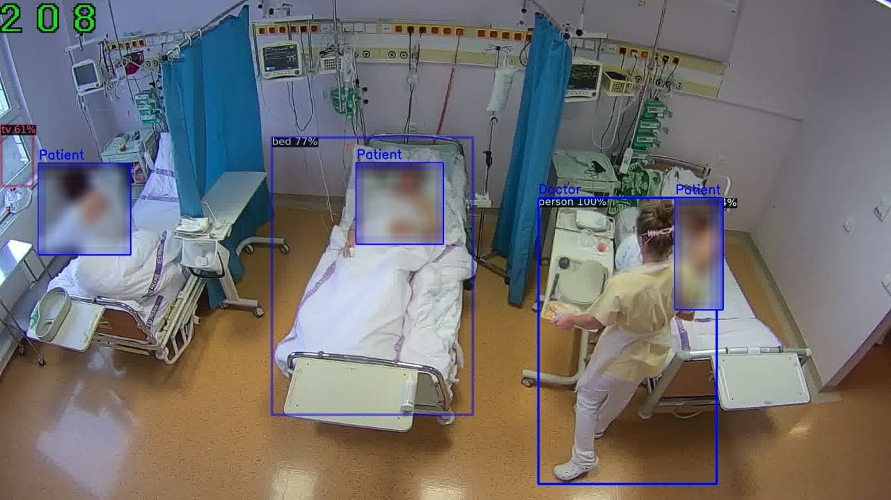
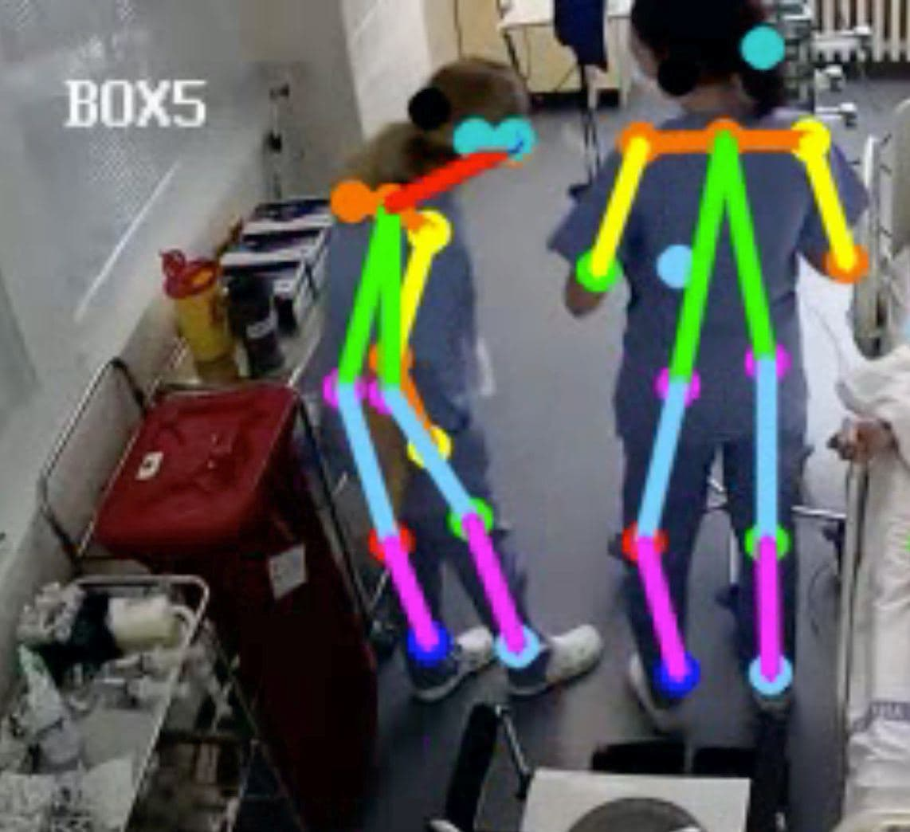
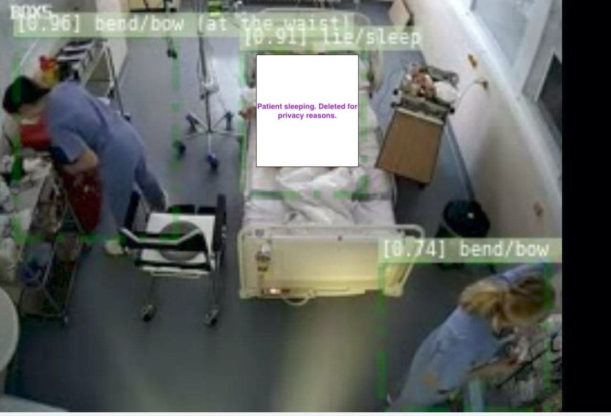

# BigBrotherICU

  

### Description
A monitoring system for ICU in hospitals which is capable of detecting patietns and medical personnel, distinguishing between doctors and nurse, detecting actions of people such as lying, sitting, walking, eating etc. Detection of such actions allows to get a better overview of what happens in ICU at all times, for example a frequency of patients walking during a night. 

## First step. Object Detection

We use Detectron2 model, where backbone is pretrained on ImageNet and object detection model is trained on COCO dataset. So, model can predict around 80 common objects like person,car, bed, plate, chair, table, laptop and so on. 

## Second step. Staff Classification.
We created a small dataset of three classes - `patient`, `doctor`, `nurse`, and trained a small neural network `people_classifier.py` to classify them.
Having first two steps allow to identify how many people are in the room and who they are.

  

## Third step. Person Tracking. 
In order to identify how nurses and doctors move from patient to patient and between bed, we created an easy person tracking tool. We also could predict if patient is in uncommon position, and medical assistence needed.

  

## Forth step. Action detection. 
We used action detection model, which could classify a person walking, siting, lying, sleeping, running, bending over and so on. This model could be used for detection uncommon behaviour of this patient.

  

## Unsuccsesfull experements.

1. Detect heart rate in some cases based on remote photoplethysmography. The model needs to be retrained, since it was trained on front face pictures, and in ICU, most of people lying so angle is not suitable.

2. Detecting if the nurse/patient who leaves the room and the ones who enters are the same people. We need to train more robust feature extraction based on "mask" of the people and not rectangle/bbox.

